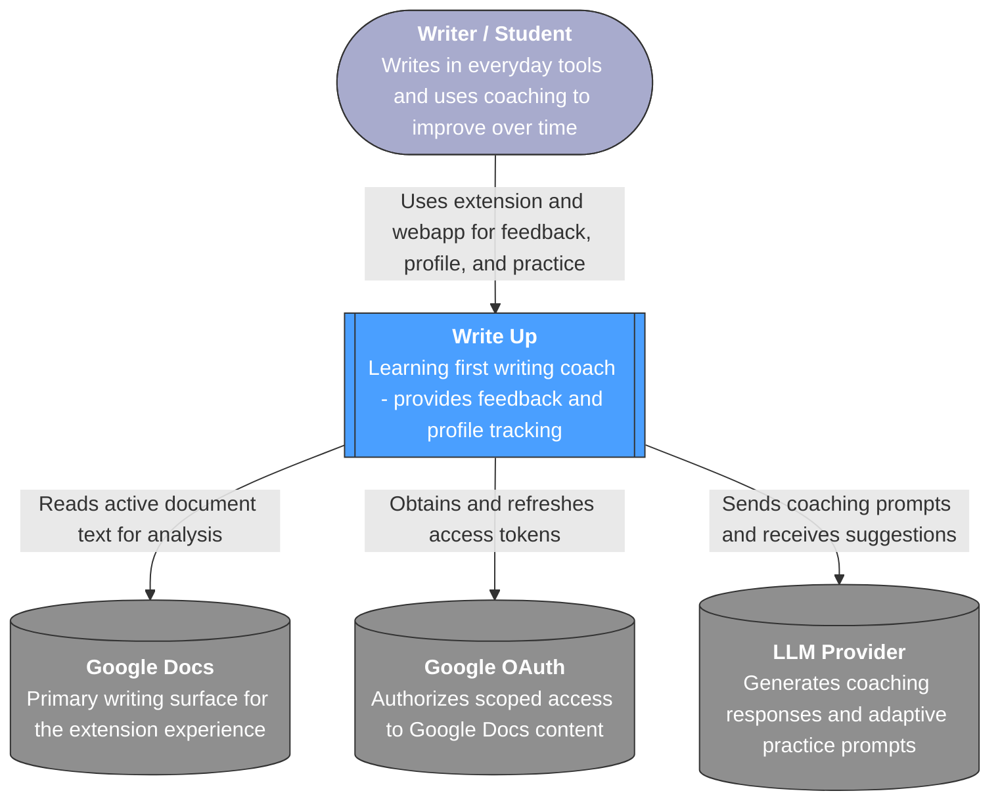

# Write Up — Architecture

This document defines a simplified C4 architecture for **Write Up** using **Option B**: split backend services for app flows vs coaching flows. It is aligned with [product-vision.md](../product-vision.md): learning-first feedback, voice preservation, and longitudinal skill growth.

The diagrams use Mermaid C4 syntax (`C4Context`, `C4Container`) and are intentionally minimal for readability.

---

## Level 1 — System Context

---

## Level 2 — Container Diagram (Option B)

```mermaid
flowchart TD
    %% 1. PERSON (TOP)
    Writer(["<b>Writer / Student</b><br/>(Person)<br/>Writes in everyday tools and uses coaching to improve over time"])

    %% 2. UI LAYER
    ChromeExt[["<b>Chrome Extension</b><br/>(Chrome MV3)<br/>Provides in-context suggestions and highlights"]]
    WebApp[["<b>Web App</b><br/>(React + Vite)<br/>Hosts onboarding and progress history"]]

    %% 3. API LAYER
    AppAPI[["<b>App API</b><br/>(Python Flask)<br/>Handles onboarding, auth, and preferences"]]
    CoachingAPI[["<b>Coaching API</b><br/>(Node + Express)<br/>Runs RAG retrieval and coaching generation"]]

    %% 4. DATA LAYER
    UserDB[("<b>User Data Store</b><br/>(Firebase)<br/>Stores users and feedback history")]
    KnowledgeBase[("<b>Coaching Knowledge Base</b><br/>(Markdown/Text)<br/>Reference material for RAG")]

    %% 5. EXTERNAL SYSTEMS (BOTTOM)
    GDocs[("<b>Google Docs</b><br/>(External System)")]
    GOAuth[("<b>Google OAuth</b><br/>(External System)")]
    LLM[("<b>LLM Provider</b><br/>(External System)")]

    %% --- RELATIONSHIPS WITH LABELS ---
    Writer -->|"Writes and receives<br/>live coaching"| ChromeExt
    Writer -->|"Views onboarding,<br/>issues, and progress"| WebApp

    ChromeExt -->|"Reads/stores issue history<br/>for sidebar display"| AppAPI
    ChromeExt -->|"Requests live coaching<br/>and sends dismiss signals"| CoachingAPI
    WebApp -->|"Onboarding dashboard<br/>and history APIs"| AppAPI
    WebApp -->|"Submits baseline writing<br/>sample (future)"| CoachingAPI

    AppAPI -->|"Reads/writes user state<br/>and feedback history"| UserDB
    CoachingAPI -->|"Reads/writes profile,<br/>issue trends, and outcomes"| UserDB
    CoachingAPI -->|"Retrieves relevant<br/>guidance chunks"| KnowledgeBase

    %% External Connections
    ChromeExt ---->|"Reads active doc content"| GDocs
    AppAPI ---->|"Obtains access tokens"| GOAuth
    CoachingAPI ---->|"Generates coaching output"| LLM

    %% --- LAYOUT ANCHORS ---
    %% Invisible links to force the vertical stack and prevent horizontal shifting
    ChromeExt ~~~ AppAPI
    WebApp ~~~ CoachingAPI
    UserDB ~~~ GOAuth
    KnowledgeBase ~~~ LLM

    %% --- STYLING ---
    style Writer fill:#A8ABCD,stroke:#333,color:#fff
    style ChromeExt fill:#4A9FFF,stroke:#333,color:#fff
    style WebApp fill:#4A9FFF,stroke:#333,color:#fff
    style AppAPI fill:#4A9FFF,stroke:#333,color:#fff
    style CoachingAPI fill:#4A9FFF,stroke:#333,color:#fff
    style UserDB fill:#4A9FFF,stroke:#333,color:#fff
    style KnowledgeBase fill:#4A9FFF,stroke:#333,color:#fff
    style GDocs fill:#8F8F8F,stroke:#333,color:#fff
    style GOAuth fill:#8F8F8F,stroke:#333,color:#fff
    style LLM fill:#8F8F8F,stroke:#333,color:#fff
```

---

## Scope Notes

- MVP flow: extension + web app + split APIs + shared Firebase data layer.
- Stretch goals are represented as `(future)` behavior inside existing containers, not extra boxes.
- Recommended evolution path: add an async profile worker later if reassessment/pruning workloads grow.
