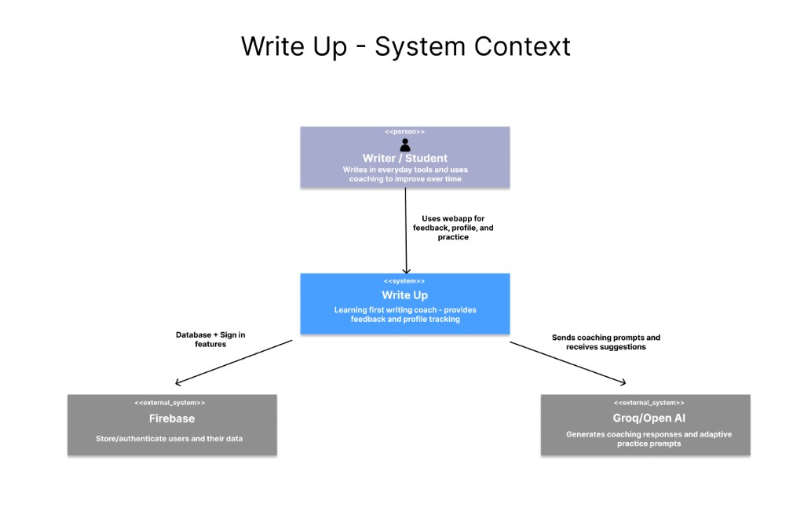
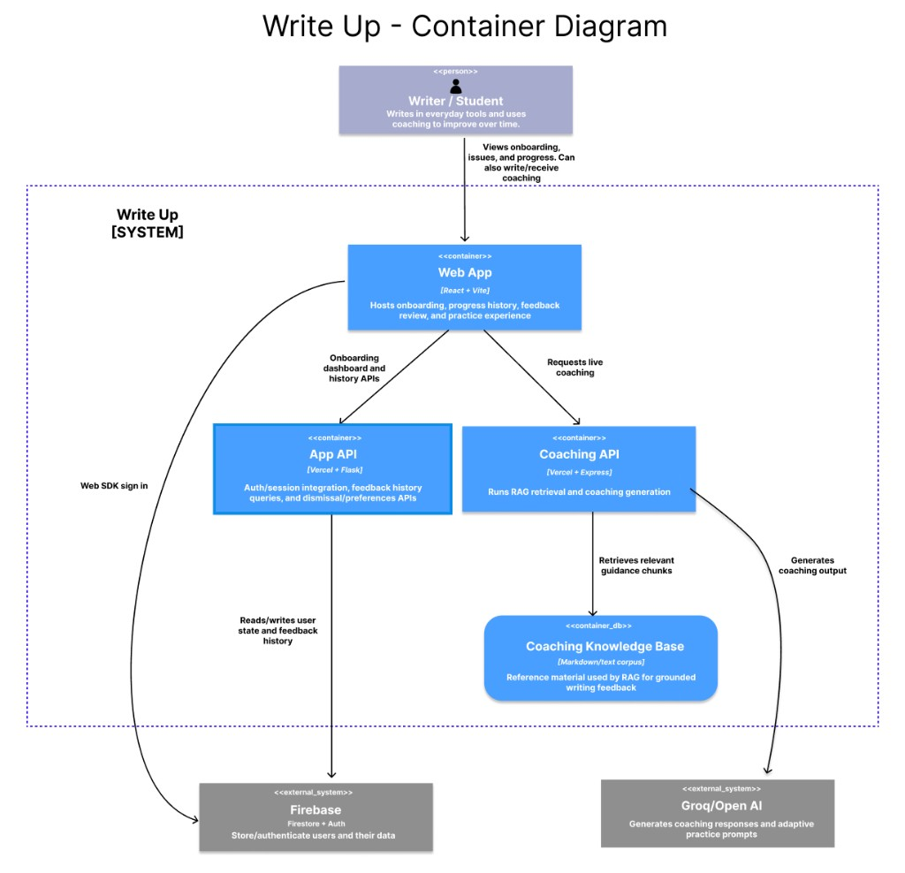

## Product vision (revisited) 
W2 Product Vision:
FOR aspiring writers and students in the English language
WHO need a clear roadmap of their linguistic blind spots, rather than just a quick fix for typos
THE Write Up product is a personalized writing mentor and diagnostic dashboard
THAT builds a "Linguistic Profile" of your writing habits over time, identifying deep-seated patterns in syntax, tone, and vocabulary
UNLIKE Grammarly, which acts as an automated editor focused on the "now" or instant corrections
OUR PRODUCT acts as a long-term tutor, providing pedagogical feedback. It explains the logic behind the error and tracks the user's specific history of mistakes to ensure mastery.
POWERED BY Recursive Linguistic Diagnostics (RLD) that track more complex syntax and user-specific writing patterns and Generative Adaptive Learning to create practice activities based on the user's writing style.

Shifts: The “Our Product” statement has shifted, since before we had envisioned providing exercises and training to help the user improve. That has since felt out of the scope of our project, and we’ve instead focused more on the feedback end. 

## W4 intended architecture 
W4 Architecture Diagrams: https://github.com/CSEN-SCU/csen-174-s26-team-project-write-up/blob/main/architecture/architecture.md 

Our initial goal was to build a joint web app and extension product that provided feedback and advice on an active Google Doc. That feedback and the user’s common tendencies would then be available to review from the web app. We planned to have a “Coaching API” to generate feedback via a RAG model and calls to an external LLM model and an “App API” to handle users, authentication, and history. We planned to store user data with Firebase, utilize GoogleOAuth to scan Google Docs, and store a basis for coaching knowledge in text or markdown files.

## Current-state architecture 
Current C4 context diagram:

Current C4 container diagram:

## Decisions that shifted 
Shift: Switching to Serverless APIs
Context: Our team ran into a lot of issues when it came to connecting the frontend to the backend in the deployed version of our product. It would work locally, but not through the live web app.
Decision: Our team decided to switch to servless APIs that could each be hosted individually on Vercel along with the web app so that the backend could be connected live rather than being constantly run locally. 
Consequences: This took a lot of work to restructure, and a lot of our old work needed to be scrapped. It meant some risk was involved while we shifted in loosing our work, and means we have more cruft now with our old files.
Classification: This was prudent and inadvertent, as our understanding led us to believe we had picked the correct API model the first time, but now that we know better we have made the switch to achieve deployed functionality.

Shift: Removal of the Web Extension
Context: With the timeline we have to work on this product, we won’t have the time to complete all of the elements we envisioned at the start of the project. 
Decision: We decided it was best to move away from the extension element, since it involved complicated elements we don’t have good fixes for, and the web app will be able to provide the core functionality we want on its own.
Consequences: The extension allowed a more seamless integration of feedback into the user’s day to day writing, so they will now have to intentionally use our web app for feedback rather than getting it right on their own documentation. 
Classification: This is deliberate and prudent, as it is necessary to make a more complete project by the deadline, but should not greatly lower the quality of the product.

## Tech debt heading into code freeze 
Old files from our prototypes - prudent and deliberate - an important part of our process, and likely to cause more issues if deleted at this point, so we’ll probably leave them
Old files from our extension - prudent and inadvertent - will likely leave so that we could build the extension back in if we continue this project in the future
Old files from our Flask/Firebase API servers - prudent and inadvertent - will likely leave so that we don’t create more issues by accidentally deleting files we still need
Skipped and unrelevant tests - prudent and inadvertent - will likely be commented out to keep posterity and functionality

## One sentence on what the team would do differently with another sprint 
We’d probably liked to have a little more time to try and get the web extension to work, or to do more testing and fixes that improve the UI/UX of our product.