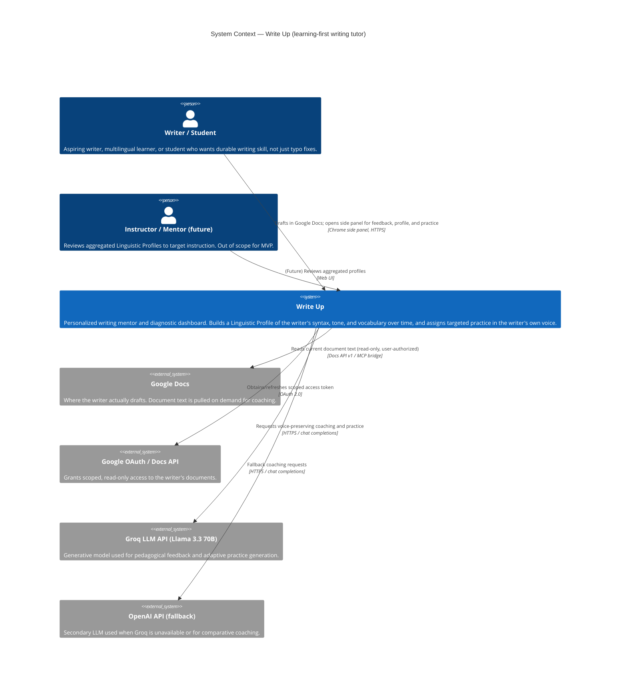

# Write Up — Architecture

This document describes the target architecture for **Write Up** by composing Ishika's Chrome extension + Google Docs integration (the capture/UI surface) with Chris's RAG-based coaching server (the Linguistic Profile engine). It is aligned with [product-vision.md](../product-vision.md): a long-term tutor — not an autocorrect — that tracks patterns over time and gives voice-preserving, pedagogical feedback.

The diagrams use Mermaid's built-in C4 syntax (`C4Context`, `C4Container`). Render them in any Mermaid-aware viewer (GitHub, Cursor, `mermaid-cli`).

---

## Level 1 — System Context

Who uses Write Up and which external systems it touches.

---

## Level 2 — Containers

How the system is decomposed into deployable/runnable units. The **Chrome extension** is the primary capture surface; the **Flask API** brokers Google Docs access and the word bank; the **Coaching Engine** owns RAG + the Linguistic Profile; both back-end services call a shared LLM.

```mermaid
C4Container
    title Container Diagram — Write Up

    Person(writer, "Writer / Student", "Drafts in Google Docs and reviews coaching in a side panel.")

    System_Boundary(writeup, "Write Up") {

        Container_Boundary(capture, "Capture & UI surface (Ishika prototype)") {
            Container(ext_sidepanel, "Side Panel UI", "Chrome MV3 extension, HTML/CSS/JS", "Lets the writer paste or sync a draft, pick focus areas (vocabulary / tone / clarity), see feedback, and browse the word bank.")
            Container(ext_content_docs, "Google Docs Content Script", "JS injected into docs.google.com", "Observes the active Doc, debounces edits, and triggers live coaching via DOM scrape or MCP bridge (doc_id).")
            Container(ext_content_landing, "Landing Content Script", "JS injected into local landing page", "Enhances the marketing/landing experience served by the Flask API.")
            Container(ext_bg, "Background Service Worker", "Chrome MV3 service worker", "Routes messages between content scripts and side panel; opens the side panel on action click.")
            Container(landing, "Landing Pages", "Static HTML/CSS served by Flask", "Marketing surface and feedback entry points (index.html, feedback.html, styles.css).")
        }

        Container_Boundary(integration, "Integration & Identity API (Ishika prototype)") {
            Container(flask_api, "Write Up Flask API", "Python 3, Flask, flask-cors", "Exposes /api/feedback, /api/word-bank, /api/mcp/call. Builds focus-specific prompts, calls Groq, parses vocabulary upgrades, and persists them.")
            ContainerDb(vocab_db, "Vocabulary / Word Bank DB", "SQLite (writeup.db)", "Stores recurring vocabulary upgrades (from -> to -> note) to surface as the writer's personal word bank.")
            Container(mcp_bridge, "Google Docs MCP Bridge", "Python function inside Flask", "Wraps Google Docs API calls as an MCP tool (google_docs.get_document_text) that the extension and coaching engine can invoke uniformly.")
        }

        Container_Boundary(coach, "Coaching Engine (Chris prototype)") {
            Container(web_app, "Write Up Web App", "React + Vite SPA", "Alternate authoring surface: create/edit documents, autosave, view debounced live coaching with source chunks and profile snapshot.")
            Container(express_api, "Coach API", "Node.js, Express", "Exposes /coach, /api/documents, /health. Orchestrates retrieval, heuristics, spellcheck, LLM, and profile updates.")
            Container(rag, "RAG Retriever", "TF-IDF over local markdown", "Indexes the knowledge corpus and retrieves top-k teaching chunks for each draft (full draft + tail window + spell-augmented query).")
            Container(spell, "Spell & Grammar Heuristics", "nspell + dictionary-en + regex rules", "Flags high-confidence spelling and agreement issues the LLM sometimes skips.")
            ContainerDb(kb, "Coaching Knowledge Corpus", "Markdown files on disk", "Editable teaching material: coaching-principles, grammar-and-punctuation-rules, reader-centered-clarity.")
            ContainerDb(docs_store, "Documents Store", "JSON file (documents-store.json)", "Drafts created in the web app (title, content, timestamps).")
            ContainerDb(profile_store, "Linguistic Profile Store", "JSON file (profile-store.json)", "Per-user aggregates: avg sentence length, hedges, comma-splice signals, long-sentence rate, etc. — the Linguistic Profile.")
        }
    }

    System_Ext(gdocs, "Google Docs", "Source of truth for the writer's drafts.")
    System_Ext(gauth, "Google OAuth", "Issues scoped access tokens.")
    System_Ext(groq, "Groq LLM API", "Primary LLM (Llama 3.3 70B Versatile).")
    System_Ext(openai, "OpenAI API", "Fallback LLM (gpt-4o-mini).")

    Rel(writer, ext_sidepanel, "Opens side panel, picks focus, reviews feedback & word bank", "Chrome UI")
    Rel(writer, ext_content_docs, "Drafts in Google Docs while extension observes", "DOM events")
    Rel(writer, web_app, "Alternate: drafts directly in Write Up web app", "HTTPS")
    Rel(writer, landing, "Visits landing / feedback pages", "HTTPS")

    Rel(ext_content_docs, ext_bg, "Relays debounced Doc snapshots and status", "chrome.runtime messaging")
    Rel(ext_content_landing, ext_bg, "Landing enhancements", "chrome.runtime messaging")
    Rel(ext_sidepanel, ext_bg, "Reads/writes live settings and status", "chrome.storage / runtime messaging")

    Rel(ext_sidepanel, flask_api, "POST /api/feedback, GET /api/word-bank", "HTTP/JSON on 127.0.0.1:5050")
    Rel(ext_content_docs, flask_api, "POST /api/feedback (live=true, optional use_mcp + doc_id)", "HTTP/JSON on 127.0.0.1:5050")
    Rel(flask_api, vocab_db, "Reads word bank, inserts new vocabulary pairs", "SQLite")
    Rel(flask_api, mcp_bridge, "Invokes google_docs.get_document_text when use_mcp=true", "in-process call")
    Rel(mcp_bridge, gdocs, "GET /v1/documents/{id}", "HTTPS + Bearer token")
    Rel(mcp_bridge, gauth, "Uses GOOGLE_DOCS_ACCESS_TOKEN (documents.readonly)", "OAuth 2.0")
    Rel(flask_api, groq, "Chat completion with focus-specific prompt + vocabulary memory", "HTTPS")

    Rel(web_app, express_api, "POST /coach, GET/POST /api/documents", "HTTPS / proxied in dev")
    Rel(ext_sidepanel, express_api, "(Integrated target) POST /coach with userId for Linguistic Profile", "HTTP/JSON on 127.0.0.1:8787")
    Rel(express_api, rag, "Multi-query retrieval for each coaching pass", "in-process")
    Rel(rag, kb, "Loads and indexes markdown chunks at startup", "fs.readFile")
    Rel(express_api, spell, "Adds high-confidence spelling/grammar cards", "in-process")
    Rel(express_api, docs_store, "CRUD drafts from the web app", "fs JSON")
    Rel(express_api, profile_store, "Reads prior notes; writes updated Linguistic Profile per request", "fs JSON")
    Rel(express_api, groq, "Primary coach LLM call with RAG + profile context", "HTTPS")
    Rel(express_api, openai, "Fallback coach LLM call", "HTTPS")

    Rel(flask_api, landing, "Serves landing pages", "HTTP")

    UpdateLayoutConfig($c4ShapeInRow="3", $c4BoundaryInRow="1")
```

---

## How the pieces map to the product vision

| Product vision element | Where it lives in the architecture |
| --- | --- |
| "Long-term tutor, not an automated editor" | Express `Coach API` orchestration + prompt rules in the Express service explicitly forbidding full rewrites. |
| **Linguistic Profile** | Express `Coach API` profile logic + `profile-store.json` (`avgSentenceLength`, `longSentenceRate`, `contractionRate`, `firstPersonRate`, `hedgeCounts`, splice signals, etc.). |
| **Recursive Linguistic Diagnostics (RLD)** | Per-request `analyzeWritingSignals` -> `mergeProfile` -> `summarizeProfile` in the Coach API, fed back into the next prompt so each session builds on prior patterns. |
| **Generative Adaptive Learning** (practice in user's own style) | LLM calls from both the Flask API and the Coach API augmented with the user's profile snapshot + RAG teaching chunks; the personal word bank in `writeup.db` reuses the writer's own prior swaps. |
| Preserve voice, dialect, and non-dominant English | Voice/stance rules baked into the Coach API system prompt; `SPELL_ALLOW` list in the spellchecker; mode switch that suppresses nitpicks while drafting. |
| Capture writing where it actually happens | Chrome extension `Google Docs Content Script` + `Google Docs MCP Bridge` reading documents read-only via OAuth. |
| Separate "teach me" from "fix it for me" | Focus picker in `Side Panel UI` (vocabulary / tone / clarity) + Coach API emits at most one optional `micro_edit` per card. |
| Fair, sustained support for multilingual / dyslexic / dialect users | Knowledge corpus (`coaching-principles.md`, `reader-centered-clarity.md`) + voice-preserving prompt + longitudinal profile instead of one-off correction. |
