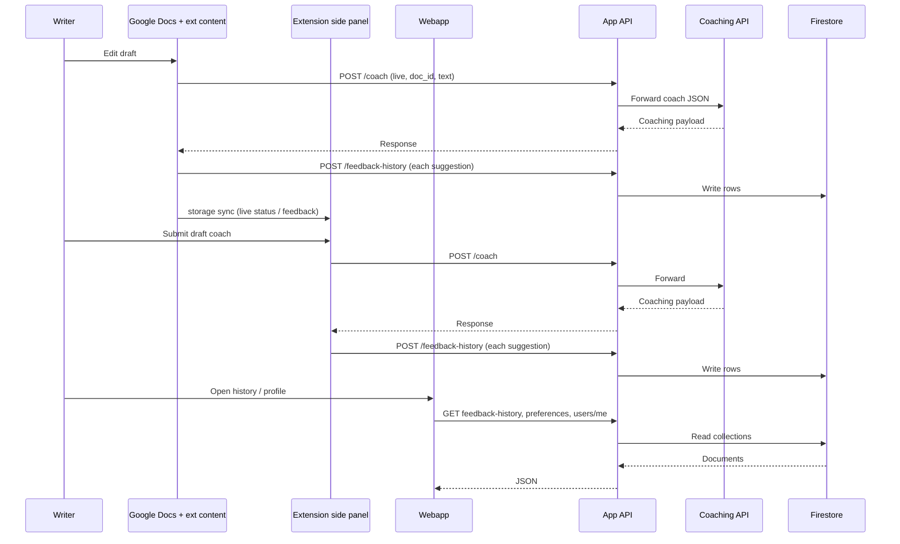

# Cross-platform user flow spec (Docs ↔ webapp ↔ feedback loop)

This document is the **behavioral spec** for how a single writer moves between **Google Docs** (via the Chrome extension), the **webapp**, and the **feedback loop** (coaching, dismissal, and saved history). It aligns with [product-vision.md](product-vision.md) (longitudinal habits, voice preservation) and [architecture.md](architecture.md) (Option B: app-api vs coaching-api).

---

## 1. Surfaces and responsibilities

| Surface | Role today | Primary APIs |
|--------|------------|--------------|
| **Google Docs** (`https://docs.google.com/document/...`) | Live writing; extension **content script** reads draft text (DOM) or **MCP / Docs API** when `docsLiveUseMcp` is on; optional live coaching when the side panel enables “live” | `POST /coach` on **app-api** (proxied to coaching-api); `chrome.storage.local` for live status and last feedback text · **MCP testing:** [mcp-google-cloud-testing.md](mcp-google-cloud-testing.md) |
| **Chrome extension — side panel** | Paste-or-type draft, focus toggles, word bank; opens from Chrome | `POST /coach`, `GET /feedback-history?docId=active` on **app-api** |
| **Webapp** (React) | Dashboard, onboarding layout, **history** by document, profile/preferences UI | `GET/POST` **app-api** routes under `/api` in dev (Vite proxy); coach via `POST /coach` when wired |
| **App API** | Auth, Firestore-backed **feedback history**, user/preferences; **coach proxy** | See [api-contracts.md](api-contracts.md) |
| **Coaching API** | RAG + LLM + local **coaching profile** (not Firestore) | Reached **only** through app-api for browser/extension clients |

**Cross-platform rule:** every call that must attribute data to a person goes through **app-api** with the same **authenticated user** (`userId` forced from the token on coach/dismiss). The webapp and extension must converge on that identity (Firebase ID token in production; documented dev bypass for local only).

---

## 2. Identifier contract

These identifiers keep Docs, extension, and webapp consistent.

- **`userId`** — Stable account id from Firebase Auth (after verification on app-api). Clients must not rely on spoofable body fields for authorization; app-api overwrites `userId` on `POST /coach` and `POST /dismiss` per [api-contracts.md](api-contracts.md).
- **`docId`** — Logical document key for **Firestore `feedback_history`**.  
  - **In Google Docs:** use the Google **document id** from the URL (`/document/d/<docId>/`). The content script already derives this for live mode.  
  - **In the side panel:** the code uses the sentinel `active` for word-bank reads until a real doc id is threaded through.  
  - **In the webapp:** `History` and `api.history(docId)` should use the same `docId` string the writer cares about (e.g. Google doc id when the draft lived in Docs).
- **`cardId`** — Optional disambiguator for multiple feedback cards per doc (defaults in API). Use when the UI tracks individual suggestions.

Persisting a loop closure: **`POST /feedback-history`** requires `docId` plus card metadata (`cardId`, `category`, `issue`, `why`, `fixOptions`, `sources`, `confidence` as applicable) — see `backend/app-api/routes/feedback_history.py` and `backend/app-api/firebase/schema.md`.

---

## 3. User flows (normative)

### Flow A — “Coach this draft” (side panel)

1. Writer opens the extension **side panel** and pastes or types text, selects **focus** areas, submits.
2. Client sends `POST {APP_API_BASE}/coach` with JSON body (`text`, `focus`, …) and auth headers (Bearer or dev `X-Debug-User` per environment).
3. App-api verifies identity, sets `userId`, forwards to coaching-api, returns structured coaching (`suggestions` / `feedback` string, etc.).
4. Writer reads feedback in the panel; **word bank** loads prior saved items via `GET /feedback-history?docId=active` (same auth headers as coach in local dev).
5. After each successful coach response, the extension **`POST`s one `feedback-history` row per suggestion** (same `docId`: `active` in the side panel, or the Google **document id** in live Docs) so the **webapp History** view (`/history?docId=…`) stays in sync.

### Flow B — “Live coach while I write in Google Docs”

1. Writer enables live coaching in the side panel (persists `docsLiveEnabled` and `docsLiveFocus` in `chrome.storage.local`).
2. Content script on the Doc tab observes edits (debounced), extracts text (or MCP path with `doc_id` only).
3. Script calls `POST /coach` on app-api with payload including `doc_id`, `text` (if not MCP), `focus`, and flags such as `live: true`.
4. On success, feedback text is written to `chrome.storage.local`; the script **`POST`s each suggestion to `feedback-history`** using the Doc’s id so **History** in the webapp can filter by the same `docId`.

### Flow C — “Reflect and manage account on the web”

1. Writer opens the **webapp** (onboarding, dashboard, history, profile).
2. Authenticated reads/writes: `GET /users/me`, `GET/PUT /preferences`, `GET/POST /feedback-history` via the Vite `/api` proxy to app-api, with **Bearer** token when auth UI is wired.
3. **History** view is authoritative for “what we saved for **this `docId`**” across sessions.

**Cross-link:** opening History for the **same** `docId` as the Google Doc the user edited ties **Docs** work to **webapp** reflection.

### Flow D — Dismissal and “don’t show again” (split today)

- **Coaching-api** `POST /dismiss` (via app-api proxy) updates the **coaching profile** store used for personalization on the Node service.
- **App-api** `POST /dismissals` is currently a **stub** (501); app-owned dismissal records in Firestore per schema are not implemented yet.

Spec expectation: product should decide whether dismissals are **primarily** coaching-profile signals, **Firestore audit** rows, or both, then implement `dismissals` accordingly without double-booking semantics.

---

## 4. End-to-end diagram (conceptual)

---

## 5. Configuration checklist (cross-platform dev)

- **Same `userId`:** dev bypass uses a fixed synthetic uid only for local testing; production uses one Firebase user across extension and webapp.
- **Same `docId`:** when testing Docs + webapp together, use the **Google document id** as `docId` in History URLs and in any `POST /feedback-history` payloads.
- **Both backends:** coaching-api must be up for coach routes; app-api must have `COACHING_API_BASE_URL`, the same **`COACHING_INTERNAL_SECRET`** as coaching-api (proxy header), and Firebase (or bypass) for protected routes.

---

## 6. Implementation gaps (smaller now)

| Area | Status |
|------|--------|
| Webapp / extension token refresh | Extension stores latest ID token from webapp; refresh when you revisit the webapp while signed in, or sign in again on `/extension-auth`. |
| Hosted web origin for `externally_connectable` | Manifest lists localhost only; add your production web origin when you deploy. |
| `GET /auth/google/callback` | Intentionally unused (Firebase replaces server OAuth redirect). |

---

## 7. Related documents

- [api-contracts.md](api-contracts.md) — route list and coach proxy rules  
- [architecture.md](architecture.md) — containers and external systems  
- [product-vision.md](product-vision.md) — why the feedback loop exists  
- [firebase/schema.md](../backend/app-api/firebase/schema.md) — Firestore shapes  

When behavior changes, update **this file** and **api-contracts** together so UX and API stay aligned.
