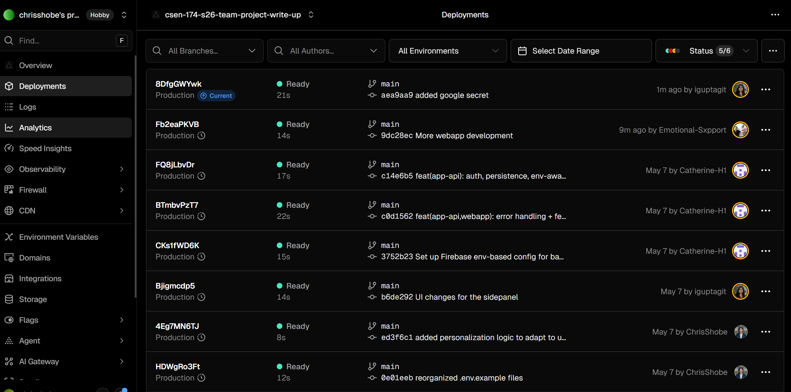

# Week 6 — GitHub Actions CI (write-up)

## Merged PR with a passing CI check 

After this workflow lands on `main`, open the repository’s **Pull requests** tab, find the merged PR that introduced `.github/workflows/ci.yml`, and link it here. The PR’s **Checks** tab should show the **CI** workflow green.

**Link:** `https://github.com/CSEN-SCU/csen-174-s26-team-project-write-up/pull/67`

## Secrets Handling

Configuration falls into two groups. **Public client configuration** (used in the browser bundle) includes standard Firebase web app settings—project ID, auth domain, storage bucket, messaging sender ID, measurement ID, app ID, and related identifiers—which are not treated as confidential in Firebase’s client model. **Confidential credentials** stay on the server: the Google OAuth **client secret** (distinct from the public client ID), the Firebase **service account** material for privileged server access, and third-party API keys such as Groq.

**CI** supplies non-secret and public build-time variables the frontend needs to compile and run against the right Firebase project and OAuth client, using repository or workflow secrets so values are not committed or echoed in logs. **Deployment** provides confidential material to backend or serverless runtimes—typically via environment variables, secret manager references, or mounted secret files—so the service account JSON and API keys never ship to the client.

The apps read these values from the environment at build or startup (for example `process.env` in Node-based tooling), so nothing sensitive is hardcoded in source; only the server tier receives credentials that must not appear in client-side JavaScript.

## Live URL

**Link:** 'https://csen-174-s26-team-project-write-up.vercel.app/'

## Deployment Screenshots

## Platfrom Decisions
We choose Vercel because it makes deploying web applications extremely fast and simple, especially for frameworks like React (which we are using). It abstracts away a lot of infrastructure work like scaling, server configuration, and global content delivery so developers can focus on building features instead of managing servers. Its platform automatically optimizes performance with edge networks, instant rollbacks, and seamless CI/CD from Git repositories, which helps teams ship updates quickly and safely. This combination of developer experience, built-in performance optimization, and tight integration with modern frontend tooling has made it a go-to choice for building and hosting high-performance web apps.