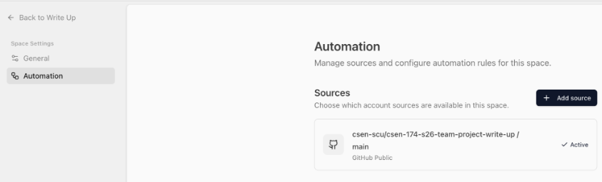

# Sprint 1 — Testing

## Part 1

> **Note:** All our individual unit tests are in our separate folders. Tests generated by the TDD AI Skill and that include multiple sections are together in the `tests` folder.

### Unit tests by team member

#### Catherine

| | |
| --- | --- |
| **Test** | `api_unit_test.py` |
| **Run** (from repo root, macOS / Linux / Git Bash) | see below |
| **What it verifies** | This test suite checks whether backend service functions correctly handle API interactions with the database. Specifically, it verifies that functions can retrieve and process key user data such as email address, focus preferences, tone settings, and Google authentication tokens. Since these functions have not yet been implemented, the tests are expected to fail at this stage. |

```bash
cd backend/app-api && python -m pytest api_unit_test.py -v
```

#### Cole

| | |
| --- | --- |
| **Test** | `test_history_page_add_entry.py` |
| **Run** | see below |
| **What it verifies** | Tests whether elements can be added to the history tab, so that in the future we can send corrections to be displayed in the web app. |

```bash
py -m pytest webapp/tests/test_history_page_add_entry.py -v
```

#### Chris

| | |
| --- | --- |
| **Test** | `guardrails.test.js` |
| **Run** | see below |
| **What it verifies** | Guardrails are a set of pure checks on coaching “cards” (suggestions) after the model returns them, so obvious bad rows never reach the UI. They do not call an LLM or Google; they only filter structured objects. |

```powershell
cd c:\Users\cutie\CSEN174\csen-174-s26-team-project-write-up\backend\coaching-api
npm test -- src/coach/guardrails.test.js
```

#### Ishika

| | |
| --- | --- |
| **Test** | `feedback.test.js` |
| **Run** | see below |
| **What it verifies** | Checks whether the feedback is being loaded on the extension side panel. |

```bash
cd extension
npm install
npm test
```

#### Miranda

| | |
| --- | --- |
| **Test** | `to-webapp.test.js` |
| **Run** | see below |
| **What it verifies** | The button on the extension calls a link to the web app when clicked. |

```bash
cd extension
npm install
npm --prefix extension test
```

---

### Integration test

| | |
| --- | --- |
| **Test** | `feedback_history_integration.py` |
| **Components involved** | Flask API routes (`/feedback-history`), Firestore database (mocked via `get_db`), and backend route handlers in `routes.feedback_history`. |
| **What interaction it verifies** | This test verifies that the end-to-end interaction between the API layer and the database layer works. It ensures that when a POST request is made to store feedback history, the data is correctly written to the Firebase database, and that a subsequent GET request retrieves that same data. It also checks behavior for an empty collection, confirming that the API returns a valid empty response rather than an error. |
| **Why this matters** | This integration test ensures that multiple backend components work together correctly, rather than just in isolation. It ensures that data flows properly from the API request through the database and back to the client, which is critical for maintaining reliable user-facing features like feedback history. Catching issues at this level helps prevent bugs that unit tests might miss, especially around data persistence and API contracts. |

---

### AI behavior test

| | |
| --- | --- |
| **Test** | `test_ai_coach_response_schema.py` |
| **AI feature being tested** | This test determines that the AI-generated structured feedback for user-submitted text using a large language model (LLM) is output correctly. The test ensures that the system returns responses in a consistent, machine-readable format that the application can reliably use. |
| **What is being asserted** | The test asserts that the AI response follows a predefined JSON schema, including required top-level fields like recommendations and metadata. It checks that each recommendation contains valid keys and approved categories, and that the number of recommendations and overall response size stay within defined limits. It also verifies that metadata fields such as token estimates and schema version meet expected constraints. |
| **Why exact wording is not used** | Exact wording is not tested because LLM outputs can vary even for the same input. Instead, the test focuses on ensuring that the structure, data types, and constraints are in place so the response is consistently usable, without creating tests that fail due to minor wording differences. |

---

## Part 2 — Tests turned GREEN

### Test History Page Add Entry

We ran the full test suite first and confirmed the History Page Add Entry test failed (RED) because the component couldn’t display any entries. We then implemented a simple feature, a tester button that injects mock corrections, so the History page could render items, which turned the test GREEN. Remaining failing tests were left for future iterations while we focused on getting this core functionality working.

### Guardrails for AI

We first ran the Vitest suite and observed RED failures in the guardrails tests because the helper functions were missing or only stubbed. We then implemented minimal versions of the pure helper functions and the guardrails pipeline, adding the required filtering logic until the tests passed (GREEN). Any remaining failing tests were deferred for future development once the core guardrail behavior was in place.

---

## Part 3 — TDD skill

| | |
| --- | --- |
| **Skill** | TDD (Test-Driven Development) from [mattpocock/skills](https://github.com/mattpocock/skills) |
| **Source** | [GitHub — `skills/engineering/tdd/SKILL.md`](https://github.com/mattpocock/skills/blob/main/skills/engineering/tdd/SKILL.md) |

We chose the TDD (Test-Driven Development) skill because it closely matches our stack and incremental approach to building features in our Chrome extension and web app. It fits well since we were already working with partially implemented functionality, and TDD lets us add tests and features one at a time instead of generating a full test suite upfront like obra/superpowers. This approach helps us catch issues early, simplify debugging, and ensure each feature meets its requirements before moving on.

After loading the skill, our workflow shifted to writing a failing test first, then implementing just enough code to make it pass, rather than building everything and testing afterward. The AI-generated tests became more focused and aligned with specific user stories, which improved clarity and made them easier to act on, though they sometimes required small adjustments for edge cases. Overall, this method gave us better structure and confidence, even if it slightly slowed initial development in favor of long-term reliability.

---

## Part 4 — TDD test reflection

### Test 1 — `tdd_test_sign_in_email_validation.py`

**Does it reflect user needs or just implementation?**

If the test checks that invalid emails show a clear error and submit stays disabled (or the server rejects them), and valid emails can proceed, it reflects user needs: fewer mistakes, less frustration, and safer account flows. If it only asserts that an `<input type="email">` exists or that a certain CSS class is present, it mostly documents the current markup, not the outcome users care about.

**Would it break under refactoring? Why or why not?**

It often would, when the test is tied to implementation details such as internal function names, private helpers, or brittle DOM selectors and file paths. Refactors that keep the same visible behavior (splitting components, renaming classes, moving the field) can then fail the test even though sign-in and validation still work the same for users.

**What inputs or edge cases are missing?**

Common gaps are empty and whitespace-only values, valid plus-addressing, very long locals, Unicode or IDN domains, homograph or confusable characters, multiple or missing `@`, and the distinction between “invalid format” and “valid format but account not found” (different user-facing messages). For school products, student email domains or SSO-only flows might matter if you skip the password entirely.

### Test 2 — `tdd_test_extension_navigation_bar.py`

**Run**

```bash
py -m pytest webapp/tests/tdd_test_extension_navigation_bar.py -v
```

**Does it reflect user needs or just implementation?**

If it checks that users can reach key tasks from the bar (e.g. open feedback, home, settings) and that labels match what writers expect, it tracks user needs. If it only asserts that five `<a>` tags exist or that a specific pixel width or `z-index` is set, it tracks what the implementation happens to look like today, not whether navigation is understandable or complete.

**Would it break under refactoring? Why or why not?**

Yes, for many extension or front-end tests: changing component hierarchy, `data-testid` names, icon-only buttons, or the order of items in the bar can break selector-based tests while the same destinations and affordances remain for users. Tests that assert routes or accessible names instead of raw structure tend to survive refactors better.

**What inputs or edge cases are missing?**

Often missing: keyboard focus and tab order, screen reader text for icon-only controls, narrow viewport/overflow, disabled items when the user is logged out, active state for the current panel, and Chrome extension context (popup vs side panel vs options page) where the bar may not exist or may differ. For a writing coach extension, missing cases include the Docs tab vs. the non-Docs tab and permissions blocked, so the bar still degrades gracefully.

### Before / after test improvement

#### Before skill

```python
"""
Unit tests: Chrome extension side panel exposes a navigation bar (tabs + layout).


These tests read static HTML/CSS from the extension tree (no Chrome runtime).
"""
import re
from pathlib import Path


import pytest


_REPO_ROOT = Path(__file__).resolve().parents[1]
_SIDEPANEL_HTML = _REPO_ROOT / "extension" / "src" / "sidepanel" / "sidepanel.html"
_SIDEPANEL_CSS = _REPO_ROOT / "extension" / "src" / "sidepanel" / "sidepanel.css"


def _read_text(path: Path) -> str:
    if not path.is_file():
        pytest.fail(f"Missing extension file: {path}")
    return path.read_text(encoding="utf-8")


def test_sidepanel_html_includes_tab_navigation_bar():
    # As a user, I see Feedback and Word Bank tabs in the side panel so I can switch between views.
    # Arrange
    html = _read_text(_SIDEPANEL_HTML)
    # Action
    has_tabbar = 'class="tabbar"' in html
    has_tabs = "tab-feedback" in html and "tab-wordbank" in html
    # Assert
    assert has_tabbar, "sidepanel.html should define the tab bar container (.tabbar)"
    assert has_tabs, "sidepanel.html should define Feedback and Word Bank tab buttons"
    assert 'role="tablist"' in html, "tab bar should be exposed as a tab list for accessibility"
    assert "Feedback" in html and "Word Bank" in html, "tab labels should be visible in markup"


def test_sidepanel_css_tabbar_is_visible_flex_layout():
    # As a user, the tab navigation row should use a visible flex layout, not be hidden with display:none.
    # Arrange
    css = _read_text(_SIDEPANEL_CSS)
    # Action
    block = re.search(r"\.tabbar\s*\{([^}]*)\}", css, re.DOTALL)
    # Assert
    assert block is not None, "sidepanel.css should define a .tabbar rule"
    tabbar_body = block.group(1)
    assert re.search(r"display\s*:\s*flex", tabbar_body), ".tabbar should use display:flex so tabs show in a row"
    assert not re.search(r"display\s*:\s*none", tabbar_body), ".tabbar should not hide the navigation with display:none"


def test_sidepanel_html_includes_top_header_bar():
    # As a user, I see a header with the product name and a home control above the tabs.
    # Arrange
    html = _read_text(_SIDEPANEL_HTML)
    # Action
    has_header = 'class="sp-header"' in html
    has_home = 'id="home-link"' in html
    # Assert
    assert has_header, "sidepanel.html should include the top header (.sp-header)"
    assert has_home, "sidepanel.html should include the home link in the header"
```

#### After

```python
"""
Contract tests for the Write Up Chrome extension side panel.


The visible navigation between main views is the tab bar (Feedback / Word Bank).
These tests assert that markup and default styles for that bar are present so it
can render in the side panel (DOM + CSS contract). They do not launch Chrome.
"""


from pathlib import Path


_REPO_ROOT = Path(__file__).resolve().parents[1]
_SIDEPANEL_HTML = _REPO_ROOT / "extension" / "src" / "sidepanel" / "sidepanel.html"
_SIDEPANEL_CSS = _REPO_ROOT / "extension" / "src" / "sidepanel" / "sidepanel.css"


def test_sidepanel_html_includes_navigation_tab_bar():
    """As a user, I see Feedback and Word Bank tabs so I can switch sidebar views."""
    assert _SIDEPANEL_HTML.is_file(), f"Missing {_SIDEPANEL_HTML}"
    html = _SIDEPANEL_HTML.read_text(encoding="utf-8")
    assert 'class="tabbar"' in html
    assert 'role="tablist"' in html
    assert 'aria-label="Write Up sidebar views"' in html
    assert 'id="tab-feedback"' in html
    assert 'id="tab-wordbank"' in html
    assert "Feedback" in html
    assert "Word Bank" in html


def test_sidepanel_css_shows_tab_bar_by_default():
    """Tab bar stylesheet keeps the bar visible (not display:none)."""
    assert _SIDEPANEL_CSS.is_file(), f"Missing {_SIDEPANEL_CSS}"
    css = _SIDEPANEL_CSS.read_text(encoding="utf-8")
    assert ".tabbar" in css
    start = css.find(".tabbar")
    block = css[start : start + 120]
    assert "display: flex" in block
    assert "display: none" not in block
```

The improved version strengthens the test from simple substring checks into a clearer UI contract test. It adds accessibility validation (`aria-label`), checks for specific element IDs instead of loose text matching, and ensures the structure is explicitly defined rather than inferred. It also improves readability and makes the test more resilient to unrelated HTML formatting changes while still enforcing the intended UI behavior.

---

## Part 5 — Jolli setup



*Automation shows the team repo `csen-scu/csen-174-s26-team-project-write-up` on branch `main` as an Active GitHub Public source.*
